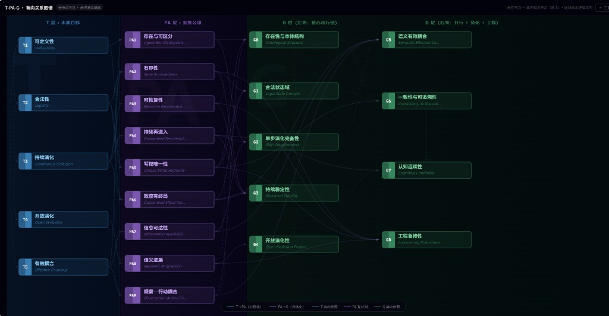

<p align="center">
  <a href="https://tashan.ac.cn/homepage/" target="_blank" rel="noopener noreferrer">
    
  </a>
</p>

<p align="center">
  <strong>可公理化的人—智能体混合数字世界底座</strong><br>
  <em>T-PA-G 三层目标—公理—要求体系 · v2.2</em>
</p>

<p align="center">
  <a href="#背景与动机">背景</a> •
  <a href="#核心创新点">核心创新</a> •
  <a href="#-创新六任意社交场景--参数取值无需专门定义">🌟 参数即场景</a> •
  <a href="#可视化预览">可视化</a> •
  <a href="#仓库内容">文档</a> •
  <a href="#生态位置">生态位置</a> •
  <a href="#贡献">贡献</a> •
  <a href="README.en.md">English</a>
</p>

[](LICENSE)

**要使"多智能体与多人共存的数字世界"成为严肃科学研究，必须先构造一个可公理化、可实现、可验证的数字世界底座。** 本仓库是该底座公理规格层的完整规范——在数学上可定义，在物理上可演化，在计算机上可规格化，并通过沙盘推演方法实现闭环验证。

---

## 🖼 可视化预览 · Live Visualization

> **无需安装 · 无需部署 · 直接在浏览器打开即可交互**



| 视图 | 链接 | 说明 |
|------|------|------|
| 🗂 **三列关系图谱（中文）** | [**→ 立即打开**](https://tashangkd.github.io/world-axiom-framework/viz/) | T \| PA \| G 三列，SVG 连线实时高亮，G层子要求直接可读 |
| ⬡ **有向图谱（全节点一屏）** | [**→ 立即打开**](https://tashangkd.github.io/world-axiom-framework/viz/viz-graph.html) | 23节点一屏，悬停放大+58条有向边逻辑标签 |
| 🌐 **English Version** | [**→ Open**](https://tashangkd.github.io/world-axiom-framework/viz/viz-en.html) | EN-primary three-column view |

---

## 背景与动机

现有 LLM 多智能体社会模拟研究面临三个公认瓶颈（JASSS 综述, Li & Tao 2026）：

1. **缺乏长期世界级闭环**——多数工作更像"场景型模拟"，难以长期自主运行
2. **基础设施不是理论变量**——环境、制度与调度常被视为工程细节，而非被纳入形式化
3. **验证停留在均值拟合**——忽视异质性、方差与边界，系统复杂度不等于科学可信度

> **本研究的核心判断**：数字世界必须先被**公理化定义**，才能被**物理实现**，才能被**计算验证**，才能让真实人以**数字分身**进入。本仓库的 T-PA-G 三层体系正是"可公理化数字世界底座"的第一层：**公理规格层**。

---

## 核心创新点

### 创新一：首套跨语境数字世界公理规格体系

| 语境 | 本体系的对应 |
|------|------------|
| **数学** | 为多主体系统定义状态空间、演化算子、约束条件与进展投影（参照 Laubenbacher 等将 ABM 嵌入有限动力系统的工作） |
| **物理** | 定义开放耦合动力系统的健康性——持续演化（不耗散堵塞）、开放演化（不假活不空转）、有效耦合（不解耦退化）|
| **计算机** | 构造"社会型状态机"的形式化规格：写隔离、真源唯一、接口完备、持续再进入、效应有终局（对应 TLA+ 传统的安全性与活性）|

### 创新二：严格的三层分离架构（T / PA / G）

```
T 层（本质目标层）—— 对任何多智能体系统成立，与实现无关
     ↓ 公理化推导
PA 层（抽象公理层）—— T 与 G 之间的结构性桥梁，与粒子体系无关
     ↓ 具体化落地
G 层（当前系统目标层）—— 与当前粒子架构绑定，含完整子要求
```

**这一分离的意义**：T 层与 PA 层可跨系统、跨版本复用；G 层被允许与实现绑定。任何工程改动若冲击 T/PA 层，说明系统的本质性质发生了变化，而非仅是实现细节的调整。

### 创新三：语义进展公理（PA8 / T4）——超越普通软件正确性

T4（开放演化）与 PA8（语义进展）的组合，要求系统不仅要"还能运行"（T3 持续演化），还要"运行不是空转"——即定义并追踪目标相关的进展投影 P(s)，在无进展循环中提供可自主触发的逃离机制。这使本体系明显超出传统软件工程的正确性讨论，进入**语义活性层**。

### 创新四：可复用的沙盘验证方法

配套文档（[三层体系元逻辑说明书_v2.md](./三层体系元逻辑说明书_v2.md)）将验证方法形式化为"沙盘推演"：

- 以 T-PA-G 为唯一判定基准，在具体状态场景中进行显式因果推导
- 要求每条失败都能沿 G→PA→T 链条向上收敛到确定性根因
- 允许发现**理论本身的遗漏**——若无处归因则说明公理体系需要增量修正

兼具**系统规范验证**与**理论元验证**双重功能。

### 创新五：为"真人进入数字世界"定义接口

本公理体系明确规定了数字分身（Digital Twin）进入世界所需满足的结构性条件：主体状态写权唯一性、认知连续性的记忆域隔离、义务系统与进展追踪。这为后续的"真人如何进入数字世界"研究（0→1 构建、1→100 逼近）提供了明确的公理层接口。

### 🌟 创新六：任意社交场景 = 参数取值，无需专门定义

> **这是本体系最具颠覆性的工程含义，也是与所有现有多智能体平台的根本区别。**

在本公理体系下，我们提出了**多智能体社会运行的最小公理集**：任何多智能体在数字世界中的交互场景，**不需要被单独定义**——只需给出 FieldProfile 几个维度的取值，系统的运行规则就是自洽的。

| 现实场景 | 传统做法 | 本体系做法 |
|---------|---------|----------|
| 线上群聊 | 写一套"群聊系统"的规则代码 | `visibility=restricted, co_presence=sync, task_binding=none` |
| 贴吧/论坛 | 写一套"帖子系统"的规则代码 | `visibility=global, co_presence=async, persistence=durable` |
| 线上会议 | 写一套"会议系统"的规则代码 | `turn_taking=moderated, co_presence=sync, formality=0.8` |
| GitHub PR | 写一套"代码审查"的规则代码 | `task_binding=strong, turn_taking=sequential, visibility=global` |
| 私信/私聊 | 写一套"私信系统"的规则代码 | `visibility=private, co_presence=async, audience_size=2` |
| 学术圆桌 | 写一套"讨论系统"的规则代码 | `turn_taking=moderated, formality=0.9, task_binding=weak` |

**公理保证了参数取值的任意组合都是自洽的**：PA 层约束了所有合法的演化路径，G 层给出了当前系统的具体实现，T 层的五个本质目标确保了系统不会在任意参数组合下崩溃或失去意义。

这意味着：**无需为每一种社交产品单独写规则，整个社会交互空间都被公理所覆盖。**

---

## 仓库内容

| 文件 | 类型 | 说明 |
|------|------|------|
| [三层目标—公理—要求体系_v2.2.md](./三层目标—公理—要求体系_v2.2.md) | **规格文档** | 完整的 T/PA/G 三层规范，含所有 G0–G8 具体子要求（Gx-Rxxx）及正式映射表 |
| [三层体系元逻辑说明书_v2.md](./三层体系元逻辑说明书_v2.md) | **逻辑说明书** | 为什么这样分层、每条公理如何从 T 推导、违反会产生什么连锁失效、沙盘框架与实用工具 |
| [viz/](./viz/) | **交互可视化** | 多种视图的完整前端代码，GitHub Pages 直接托管，无需部署 |

> `v2.2` 是规格文档（"是什么"）；元逻辑说明书是配套解读（"为什么这样"）。两者配合使用，可以同时掌握规则本身与其背后的完整推导逻辑。

### 代码结构

```
world-axiom-framework/
├── README.md                            ← 本文件
├── README.en.md                         ← 英文版
├── 三层目标—公理—要求体系_v2.2.md        ← 主规格文档（权威版本）
├── 三层体系元逻辑说明书_v2.md            ← 逻辑说明书（配套解读）
├── 可视化预览.png                         ← 图谱视图截图
├── docs/assets/tashan.svg               ← Logo
└── viz/
    ├── index.html                        ← 三列关系图谱（主入口，中文）
    ├── viz-graph.html                    ← 有向图谱（全节点一屏）
    ├── viz-en.html                       ← 英文版
    ├── meta-logic-viz.html               ← 元逻辑可视化
    ├── data.js                           ← 数据层（节点/边/英文名/子要求/58条标签边）
    ├── viz1-flow.js ~ viz5-force.js      ← 备选视图（流式/神经网络/同心圆/树/力导向）
    ├── viz6-matrix.js                    ← PA 互补对 + PA→T 服务矩阵
    └── viz7-trace.js                     ← G 层依赖矩阵 + 追溯链浏览器
```

### 可视化功能详解

**三列关系图谱（`viz/index.html`）**：三层架构直观呈现，悬停节点→SVG连线高亮，点击节点→弹窗（定义/数学表达式/违反案例/跨域类比）

**有向图谱（`viz/viz-graph.html`）**：全部 23 个节点一屏可见，58 条有向边五类分色：

| 边类型 | 含义 | 数量 |
|--------|------|:----:|
| T 层内部依赖 | T1→T2→T3→T4，串行前置依赖 | 4 |
| T→PA 公理化 | 为保住每个 T 目标，必须满足哪些 PA 公理 | 14 |
| PA 互补对（双向） | PA2↔PA3 / PA6↔PA7 / PA7↔PA9 / PA4↔PA8 | 8 |
| PA→G 具体化 | 每条 PA 在当前粒子体系中如何落地 | 23 |
| G 层内部依赖 | 串行链 + 并行 + 特化关系 | 10 |

---

## 生态位置

本项目是「人—智能体混合数字世界」体系的**第一层（公理规格层）**：

| 层级 | 项目 | 仓库 | 类型 | 状态 |
|------|------|------|------|:----:|
| 世界底座 | **① 公理体系** ← 本仓库 | [world-axiom-framework](https://github.com/TashanGKD/world-axiom-framework) | 开源 | 🟡 |
| 世界底座 | ② 体系结构 | [world-three-particle-impl](https://github.com/TashanGKD/world-three-particle-impl) | 开源 | 🔲 |
| 世界底座 | ③ 沙盘验证 | [world-sandbox-validation](https://github.com/TashanGKD/world-sandbox-validation) | 开源 | 🔲 |
| 数字分身 | ④ 0→1构建 | [digital-twin-bootstrap](https://github.com/TashanGKD/digital-twin-bootstrap) | 开源 | 🟡 |
| 数字分身 | ⑤ 1→100迭代 | [digital-twin-iteration](https://github.com/TashanGKD/digital-twin-iteration) | 开源 | 🔲 |
| 核心应用 | 数字世界应用 | TashanGKD/tashan-world（私有） | 私有 | 🔲 |
| 商业化 | 数字分身平台 | TashanGKD/tashan-twin-platform（私有） | 私有 | 🔲 |
| 公益 | 他山论坛 | [tashan-forum](https://github.com/TashanGKD/tashan-forum) | 开源公益 | 🔲 |

**直接依赖关系**：
- ② 体系结构必须满足本仓库定义的所有公理（联动规则场景A）
- ③ 沙盘验证以本仓库的 T–PA–G 体系为唯一判定基准（联动规则场景B）
- 本仓库变动触发场景A（通知②对齐）和场景B（通知③重验）

---

## 快速访问

- **三列图谱（中文）**：https://tashangkd.github.io/world-axiom-framework/viz/
- **有向图谱**：https://tashangkd.github.io/world-axiom-framework/viz/viz-graph.html
- **English View**：https://tashangkd.github.io/world-axiom-framework/viz/viz-en.html
- **GitHub 仓库**：https://github.com/TashanGKD/world-axiom-framework

---

## 贡献

欢迎贡献！详见 [CONTRIBUTING.md](CONTRIBUTING.md)（待建）。

---

## 更新日志

见 [CHANGELOG.md](CHANGELOG.md)（待建）。

---

## 许可证

MIT License. See [LICENSE](LICENSE) for details.

---

*版本：v2.2 规格文档 · 配套元逻辑说明书 v2 · 可视化 v1*  
*研究背景：[人—智能体混合数字世界研究总纲](https://github.com/TashanGKD/world-axiom-framework)*
